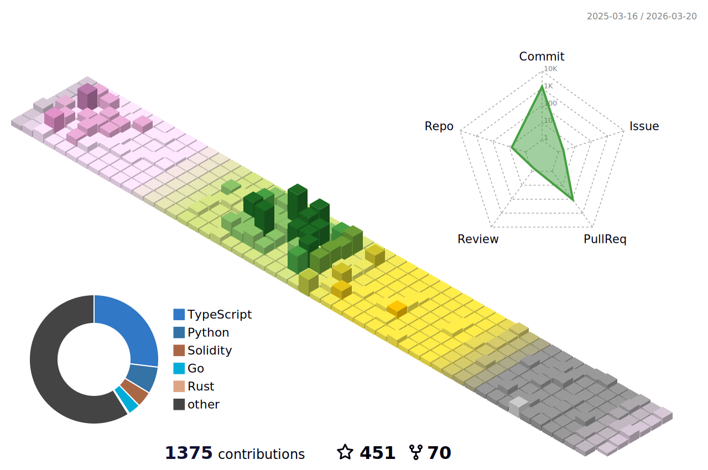
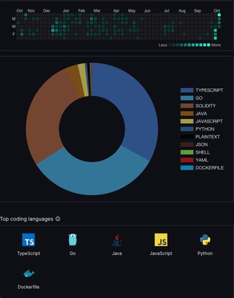

<!--   my-ticker -->
[](https://git.io/typing-svg)

<!--   my-paper -->
## 📃My Paper

- 🎮 [区块链与数字娱乐：游戏产业的去中心化与挑战](assets/区块链与数字娱乐：游戏产业的去中心化与挑战.pdf)

<!--   my-Knowledge Base -->
## 📚Knowledge Base

- 🤝 MEV的使用与预防: [什么是MEV](https://private-thursday-1d0.notion.site/MEV-111655235e348000b1cdd1caa3392190?pvs=4)

- 🔭 初识TON Network: [Ton Network](https://private-thursday-1d0.notion.site/Ton-Network-7c5f9699252642149a13f43aea0c4f24?pvs=4)

- 🌱 Solana的独特之处: [Solana的独特之处](https://private-thursday-1d0.notion.site/Solana-a86960bf338d42e38ea6045d00111973?pvs=4)

- 👯 智能合约调用方法: [单刀直入智能合约](https://private-thursday-1d0.notion.site/ecec80a9d3b04896baac7a4f67265c14?pvs=4)

- 👨‍💻 Tenderly功能的使用介绍: [Tenderly强大的Web3开发平台](https://private-thursday-1d0.notion.site/Tenderly-Web3-111655235e348009a14bd04d87cd1ecd?pvs=25)

<!--   my-header-img -->


<!--   my-skils -->

| Property                                       | Data                                                                                                                                                                                                                                                                                                                                                                                                                                                                                                                                                                                                                                                                                                                                                                                                                                                                                                                                                                                                                                                                                                                                                                                                                                                                                                                                                                                                                                                                                                                                                                                                                                                                                                                                                                                                            |
|------------------------------------------------|-----------------------------------------------------------------------------------------------------------------------------------------------------------------------------------------------------------------------------------------------------------------------------------------------------------------------------------------------------------------------------------------------------------------------------------------------------------------------------------------------------------------------------------------------------------------------------------------------------------------------------------------------------------------------------------------------------------------------------------------------------------------------------------------------------------------------------------------------------------------------------------------------------------------------------------------------------------------------------------------------------------------------------------------------------------------------------------------------------------------------------------------------------------------------------------------------------------------------------------------------------------------------------------------------------------------------------------------------------------------------------------------------------------------------------------------------------------------------------------------------------------------------------------------------------------------------------------------------------------------------------------------------------------------------------------------------------------------------------------------------------------------------------------------------------------------|
| **Language**                              |                                                                                                                                                                                                                                                                                                                                                                                                                                                                                                                                                                                                                                                                                                                                                                                                                                                                                                                                                                                                                                                                                                                                                                                                                                                                                                                                                                                                     |
| **Domain Knownledge**                          | [](https://github.com/DracoYan-111?tab=repositories&q=&type=&language=solidity&sort=) [](https://github.com/DracoYan-111?tab=repositories&q=&type=&language=solidity&sort=) [](https://github.com/DracoYan-111?tab=repositories&q=&type=&language=typescript&sort=) [](https://github.com/DracoYan-111?tab=repositories&q=&type=&language=go&sort=)                                                                                                                                                                                                                                                                                                                                                                                                                                                                                                                                                                                                                                                                                                                                                                                                                                                                                                                                                                                                                                                 |
| **CI / CD**                                    | [](https://github.com/DracoYan-111/DracoYan-111) [](https://github.com/DracoYan-111) [](https://www.docker.com)  [](https://code.visualstudio.com)                                                                                                                                                                                                                                                                                                                                                                                                                                                                                                                                                                                                                                                                                                                                                                                                                                                                                                                                                                                                                                                                                                                                                                                                                                                                                                                                                                                                                                                                                     |
| **Databases**                                  | &nbsp; [](https://www.postgresql.org)                                                                                                                                                                                                                                                                                                                                                                                                                                                                                                                                                                                                                                                                                                                                                                                                                                                                                                                                                                                                                         |
| **Tools & Platform**                           |                                                                                                                                                                                                                                                                                                                                                                                                                                                                                                                                                                                                                                                                                                                                                                                                                                                                                                                                                                                                                                                                                                                                                                                     |

<!--   GitHub stats graph -->
### 📈 GitHub Activity Graph


|😅                                                                                                                                                      |         🤪                                                                                                              |
|--------------------------------------------------------------------------------------------------------------------------------------------------------|--------------------------------------------------------------------------------------------------------------------------|
|  |  |


<!--START_SECTION:waka-->


**🐱 我的 GitHub 数据** 

> 📦  使用了 74.5 kB GitHub 存储空间 
 > 
> 🏆 419 个贡献，在 2024 年
 > 
> 💼 开放招聘
 > 
> 📜 42 个公共仓库 
 > 
> 🔑 18 个私人仓库 
 > 
**我是早起的 🐤** 

```text
🌞 早晨                     582 commits         ██████░░░░░░░░░░░░░░░░░░░   22.90 % 
🌆 白天                     1237 commits        ████████████░░░░░░░░░░░░░   48.68 % 
🌃 傍晚                     719 commits         ███████░░░░░░░░░░░░░░░░░░   28.30 % 
🌙 晚上                     3 commits           ░░░░░░░░░░░░░░░░░░░░░░░░░   00.12 % 
```
📅 **我最有效率是在 星期三** 

```text
星期一                      392 commits         ████░░░░░░░░░░░░░░░░░░░░░   15.43 % 
星期二                      401 commits         ████░░░░░░░░░░░░░░░░░░░░░   15.78 % 
星期三                      552 commits         █████░░░░░░░░░░░░░░░░░░░░   21.72 % 
星期四                      516 commits         █████░░░░░░░░░░░░░░░░░░░░   20.31 % 
星期五                      427 commits         ████░░░░░░░░░░░░░░░░░░░░░   16.80 % 
星期六                      132 commits         █░░░░░░░░░░░░░░░░░░░░░░░░   05.19 % 
星期日                      121 commits         █░░░░░░░░░░░░░░░░░░░░░░░░   04.76 % 
```


📊 **本周消耗时间** 

```text
🕑︎ 时区: Asia/Shanghai

💬 编程语言: 
本周没有记录到任何活动

🔥 编辑器: 
本周没有记录到任何活动

💻 操作系统: 
本周没有记录到任何活动
```

**我最常使用 Solidity** 

```text
Solidity                 44 repos            ████████████████░░░░░░░░░   63.77 % 
TypeScript               9 repos             ███░░░░░░░░░░░░░░░░░░░░░░   13.04 % 
Python                   2 repos             █░░░░░░░░░░░░░░░░░░░░░░░░   02.90 % 
Go                       2 repos             █░░░░░░░░░░░░░░░░░░░░░░░░   02.90 % 
JavaScript               2 repos             █░░░░░░░░░░░░░░░░░░░░░░░░   02.90 % 
```


 Last Updated on 01/10/2024 15:33:41 UTC
<!--END_SECTION:waka-->

<!--  2d history skills -->


</img>


### 🏆Github Profile Trophy

<p align="center">
<a href="https://github.com/ryo-ma/github-profile-trophy"></a>
</p>

#### I have accepted 1,918 completions in 10 different coding languages using Codeium from [My Codeium](https://codeium.com/profile/dracodecodeium)



### 📫 How to Reach me

<p align="center">
<a href="https://twitter.com/Love_Myself_T_T" target="blank"></a>
🕊️Peace and love🩷
<a href="mailto:yanlong2944@gmail.com" target="blank"></a>
</p>


