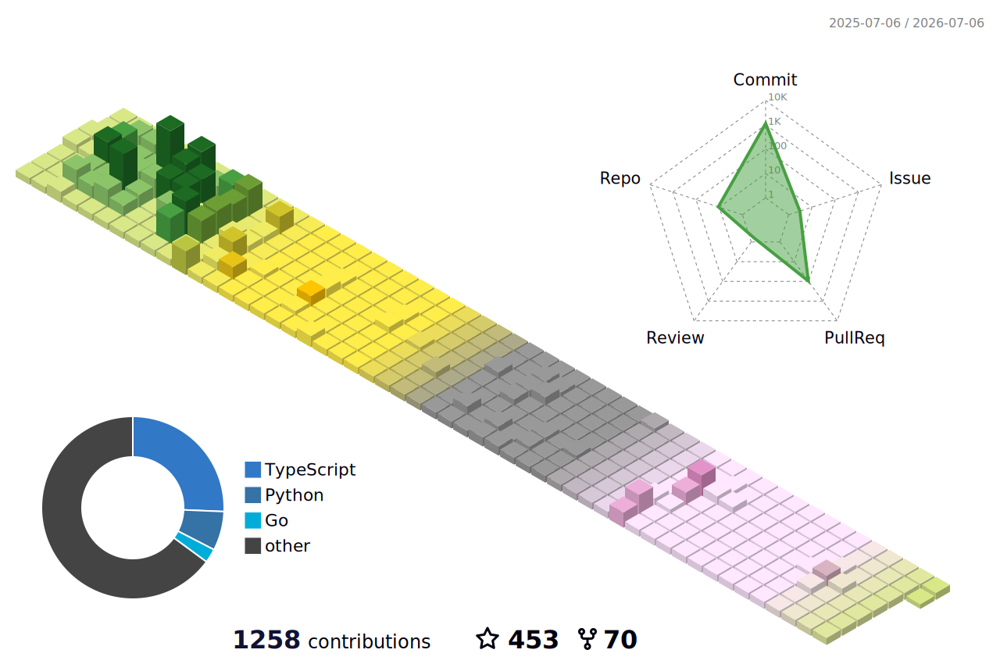
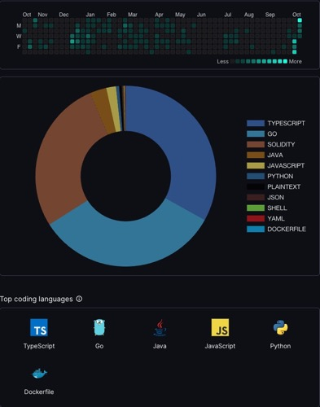

<!--   my-ticker -->
<p align="center">
  
    <a href="https://git.io/typing-svg">
    
  </a>
</p>

<!--   my-paper -->
## 📃My Paper

- 🎮 [区块链与数字娱乐：游戏产业的去中心化与挑战](assets/区块链与数字娱乐：游戏产业的去中心化与挑战.pdf)

<!--   my-Knowledge Base -->
## 📚Knowledge Base

- 🤝 MEV的使用与预防: [什么是MEV](https://private-thursday-1d0.notion.site/MEV-111655235e348000b1cdd1caa3392190?pvs=4)

- 🔭 初识TON Network: [Ton Network](https://private-thursday-1d0.notion.site/Ton-Network-7c5f9699252642149a13f43aea0c4f24?pvs=4)

- 🌱 Solana的独特之处: [Solana的独特之处](https://private-thursday-1d0.notion.site/Solana-a86960bf338d42e38ea6045d00111973?pvs=4)

- 👯 智能合约调用方法: [单刀直入智能合约](https://private-thursday-1d0.notion.site/ecec80a9d3b04896baac7a4f67265c14?pvs=4)

- 👨‍💻 Tenderly功能介绍: [Tenderly强大的Web3开发平台](https://private-thursday-1d0.notion.site/Tenderly-Web3-111655235e348009a14bd04d87cd1ecd?pvs=25)

<!--   my-header-img -->


<!--   my-skils -->

| Property                                       | Data                                                                                                                                                                                                                                                                                                                                                                                                                                                                                                                                                                                                                                                                                                                                                                                                                                                                                                                                                                                                                                                                                                                                                                                                                                                                                                                                                                                                                                                                                                                                                                                                                                                                                                                                                                                                            |
|------------------------------------------------|-----------------------------------------------------------------------------------------------------------------------------------------------------------------------------------------------------------------------------------------------------------------------------------------------------------------------------------------------------------------------------------------------------------------------------------------------------------------------------------------------------------------------------------------------------------------------------------------------------------------------------------------------------------------------------------------------------------------------------------------------------------------------------------------------------------------------------------------------------------------------------------------------------------------------------------------------------------------------------------------------------------------------------------------------------------------------------------------------------------------------------------------------------------------------------------------------------------------------------------------------------------------------------------------------------------------------------------------------------------------------------------------------------------------------------------------------------------------------------------------------------------------------------------------------------------------------------------------------------------------------------------------------------------------------------------------------------------------------------------------------------------------------------------------------------------------|
| **Language**                              |                                                                                                                                                                                                                                                                                                                                                                                                                                                                                                                                                                                                                                                                                                                                                                                                                                                                                                                                                                                                                                                                                                                                                                                                                                                                                                                                                                                                     |
| **Domain Knownledge**                          | [](https://github.com/DracoYan-111?tab=repositories&q=&type=&language=solidity&sort=) [](https://github.com/DracoYan-111?tab=repositories&q=&type=&language=solidity&sort=) [](https://github.com/DracoYan-111?tab=repositories&q=&type=&language=typescript&sort=) [](https://github.com/DracoYan-111?tab=repositories&q=&type=&language=go&sort=)                                                                                                                                                                                                                                                                                                                                                                                                                                                                                                                                                                                                                                                                                                                                                                                                                                                                                                                                                                                                                                                 |
| **CI / CD**                                    | [](https://github.com/DracoYan-111/DracoYan-111) [](https://github.com/DracoYan-111) [](https://www.docker.com)  [](https://code.visualstudio.com)                                                                                                                                                                                                                                                                                                                                                                                                                                                                                                                                                                                                                                                                                                                                                                                                                                                                                                                                                                                                                                                                                                                                                                                                                                                                                                                                                                                                                                                                                     |
| **Databases**                                  | &nbsp; [](https://www.postgresql.org)                                                                                                                                                                                                                                                                                                                                                                                                                                                                                                                                                                                                                                                                                                                                                                                                                                                                                                                                                                                                                         |
| **Tools & Platform**                           |                                                                                                                                                                                                                                                                                                                                                                                                                                                                                                                                                                                                                                                                                                                                                                                                                                                                                                                                                                                                                                                                                                                                                                                     |

<!--   GitHub stats graph -->
### 📈 GitHub Activity Graph


|😅                                                                                                                                                      |         🤪                                                                                                              |
|--------------------------------------------------------------------------------------------------------------------------------------------------------|--------------------------------------------------------------------------------------------------------------------------|
|  |  |

<!--START_SECTION:waka-->


**🐱 My GitHub Data** 

> 📦 135.5 kB Used in GitHub's Storage 
 > 
> 🏆 182 Contributions in the Year 2026
 > 
> 💼 Opted to Hire
 > 
> 📜 49 Public Repositories 
 > 
> 🔑 23 Private Repositories 
 > 
**I'm an Early 🐤** 

```text
🌞 Morning                3640 commits        ████████░░░░░░░░░░░░░░░░░   31.70 % 
🌆 Daytime                4739 commits        ██████████░░░░░░░░░░░░░░░   41.27 % 
🌃 Evening                2624 commits        ██████░░░░░░░░░░░░░░░░░░░   22.85 % 
🌙 Night                  480 commits         █░░░░░░░░░░░░░░░░░░░░░░░░   04.18 % 
```
📅 **I'm Most Productive on Monday** 

```text
Monday                   3177 commits        ███████░░░░░░░░░░░░░░░░░░   27.67 % 
Tuesday                  2184 commits        █████░░░░░░░░░░░░░░░░░░░░   19.02 % 
Wednesday                2370 commits        █████░░░░░░░░░░░░░░░░░░░░   20.64 % 
Thursday                 1508 commits        ███░░░░░░░░░░░░░░░░░░░░░░   13.13 % 
Friday                   1560 commits        ███░░░░░░░░░░░░░░░░░░░░░░   13.59 % 
Saturday                 402 commits         █░░░░░░░░░░░░░░░░░░░░░░░░   03.50 % 
Sunday                   282 commits         █░░░░░░░░░░░░░░░░░░░░░░░░   02.46 % 
```


📊 **This Week I Spent My Time On** 

```text
🕑︎ Time Zone: Asia/Shanghai

💬 Programming Languages: 
Solidity                 11 hrs 45 mins      ███████████████████░░░░░░   75.81 % 
YAML                     2 hrs 17 mins       ████░░░░░░░░░░░░░░░░░░░░░   14.75 % 
Go                       34 mins             █░░░░░░░░░░░░░░░░░░░░░░░░   03.74 % 
Bash                     24 mins             █░░░░░░░░░░░░░░░░░░░░░░░░   02.58 % 
JavaScript               16 mins             ░░░░░░░░░░░░░░░░░░░░░░░░░   01.78 % 

🔥 Editors: 
Antigravity              15 hrs 18 mins      █████████████████████████   98.69 % 
VS Code                  12 mins             ░░░░░░░░░░░░░░░░░░░░░░░░░   01.31 % 

💻 Operating System: 
Mac                      15 hrs 30 mins      █████████████████████████   100.00 % 
```

**I Mostly Code in Solidity** 

```text
Solidity                 46 repos            █████████████░░░░░░░░░░░░   52.27 % 
TypeScript               14 repos            ████░░░░░░░░░░░░░░░░░░░░░   15.91 % 
Go                       9 repos             ███░░░░░░░░░░░░░░░░░░░░░░   10.23 % 
Rust                     7 repos             ██░░░░░░░░░░░░░░░░░░░░░░░   07.95 % 
Python                   3 repos             █░░░░░░░░░░░░░░░░░░░░░░░░   03.41 % 
```


 Last Updated on 14/03/2026 01:29:52 UTC
<!--END_SECTION:waka-->

<!--  2d history skills -->



</img>

### 🏆Github Profile Trophy

<p align="center">
<a href="https://github.com/ryo-ma/github-profile-trophy"></a>
</p>

#### I have accepted 2,818 completions in 11 different coding languages using Codeium from [My Codeium](https://codeium.com/profile/dracodecodeium)



### 📫 How to Reach me

<p align="center">
<a href="https://twitter.com/Love_Myself_T_T" target="blank"></a>
🕊️Peace and love🩷
<a href="mailto:yanlong2944@gmail.com" target="blank"></a>
</p>


